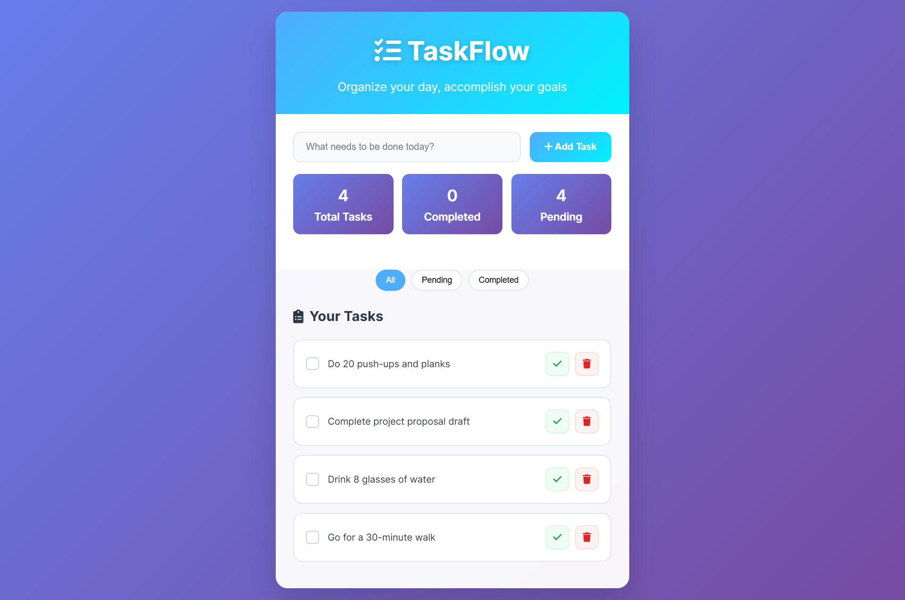

# 📝 TO DO LIST

A simple, clean, and responsive **To-Do List** web app built with **HTML, CSS, and JavaScript**.  
TaskFlow Pro helps you stay organized by letting you add, complete, and delete tasks effortlessly.

---

## 🚀 Features
- ➕ **Add Tasks** — Quickly add tasks with one click.
- ✅ **Mark as Complete** — Strike through tasks when done.
- ❌ **Delete Tasks** — Remove unwanted tasks instantly.
- 🎨 **Clean UI** — Minimal and user-friendly design.
- 📱 **Responsive** — Works on desktop, tablet, and mobile.

---

## 🖼️ Preview

---

## 🛠️ Tech Stack
- **HTML5** — Structure of the app.
- **CSS3** — Styling and responsive layout.
- **JavaScript (ES6)** — App logic and interactivity.

---
